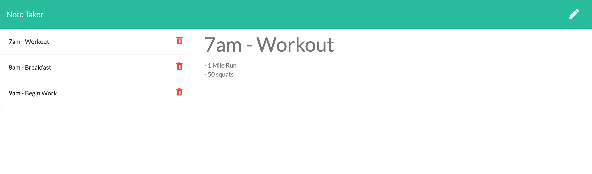

# Note Taker

## Description
This application was made using node.js and Express. It is an intuitive note taking app that allows you to save and delete notes. Each note consists of a title, which is what will be displayed in the saved notes section on the left side. Once you click on any of the saved notes, it will load the entire note and display it on screen. You can create a new note by selecting the top right pencil icon and then save it using the save icon. This application is deployed via Heroku, [click here](https://indi-notetaker-app.herokuapp.com/) to go to the deployed application.

## Table of Contents
* [Installation](#installation)
* [Usage](#usage)
* [Collaborators](#collaborators)
* [Testing](#testing)
* [License](#license)
* [Questions](#questions)

## Installation
    1. Clone this repository
    2. Open the repo via terminal/bash
    3. Run the command "npm i"
    4. Run the command "node server.js"
## Usage
The purpose, or usage, for this app is pretty straight forward. Everyone has a million things to do and it can be difficult trying to remember everything, that's why a note taking app is extremely useful to have/use.

## Collaborators
[Indervir Singh (me)](https://www.github.com/indervirsingh)

## Testing
Link to deployed app: [here](https://indi-notetaker-app.herokuapp.com/)

## License
Licensed under MIT License

## Questions
If you have questions regarding this project, please contact me through email at iindervirsingh@gmail.com
